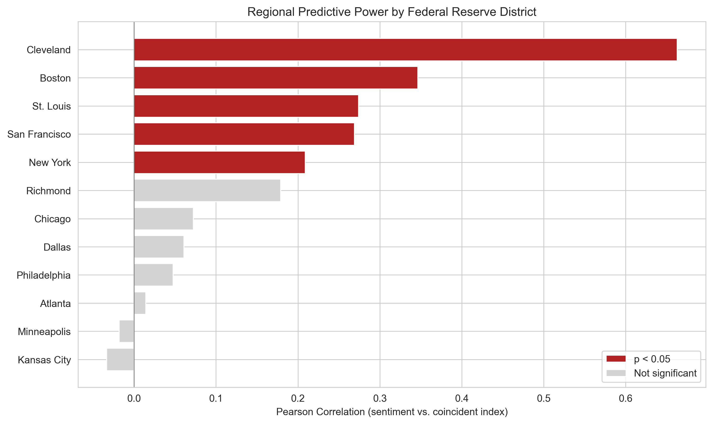
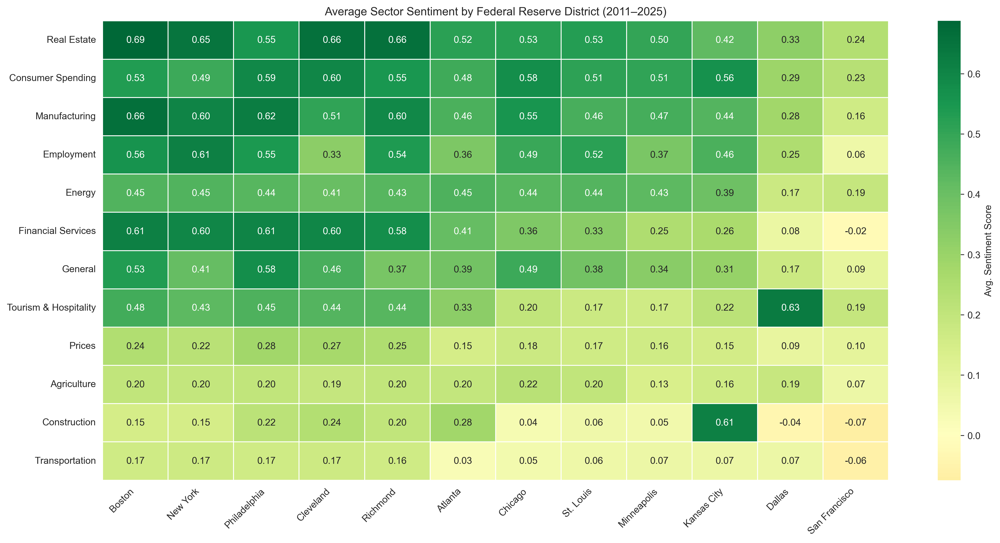

# Does the Federal Reserve's Beige Book Predict the Economy?

A quantitative study of whether narrative economic intelligence from the 12 Federal Reserve district banks contains leading information for macroeconomic indicators. Covers 2,820 district-level summaries and 10,728 sector-level paragraphs across 235 Beige Book reports (1996--2026), spanning three recessions (2001, 2008, 2020).

## Overview

Eight times per year, the Federal Reserve publishes its Summary of Commentary on Current Economic Conditions -- the Beige Book. Each of the 12 district banks compiles qualitative assessments from business contacts, bankers, and labor market participants within its region. These narratives are widely read by market participants and policymakers, yet their informational content remains difficult to quantify. If the Beige Book captures real-time economic conditions through the eyes of front-line decision-makers, its tone should contain leading information for hard economic data released weeks or months later.

This project tests that hypothesis directly. We scrape the full text of every district-level Beige Book summary published between 1996 and 2026 — covering 30 years that include the dot-com bust, the 2008 financial crisis, and COVID-19 — score each using VADER sentiment analysis (validated against two transformer-based alternatives), and assess predictive power for four national economic indicators:

| FRED Series | Indicator | Frequency |
|-------------|-----------|-----------|
| `GDPC1` | Real GDP | Quarterly |
| `UNRATE` | Unemployment Rate | Monthly |
| `CPIAUCSL` | Consumer Price Index | Monthly |
| `SP500` | S&P 500 | Daily |

The analytical framework combines lagged Pearson and Spearman correlations, Granger causality tests (up to 4 lags), OLS regression with lead-lag structure, and out-of-sample evaluation with a pre-2019 training cutoff. Time alignment uses `pd.merge_asof(direction='forward')` so that sentiment at time T maps to the next available indicator observation -- a genuine forward-looking test that avoids look-ahead bias.

## Key Findings

| Indicator | Granger-Causes? | Best Lag | Correlation (r) | OLS Controlled (p) | Out-of-Sample RMSE |
|-----------|----------------|----------|-----------------|---------------------|---------------------|
| **Unemployment** | Yes (lags 3--4) | 3--4 | **-0.59** | **p < 0.001** | -0.0012 improvement |
| **GDP** | Yes (lags 1--2) | 1--2 | 0.15 | Insufficient quarterly obs. | -- |
| **CPI** | Yes (lags 3--4) | 3--4 | 0.05 | **p = 0.001** | -0.0791 improvement |
| **S&P 500** | No | -- | -0.28 | p = 0.074 | No improvement |

The strongest and most economically intuitive result is for **unemployment** (r = -0.59, p < 0.001). When Beige Book narratives turn more positive, unemployment tends to fall in subsequent months. This is consistent with the structure of the data: district banks survey businesses directly about hiring plans, order backlogs, and labor availability -- information that leads the official labor statistics by the time lag inherent in BLS data collection and publication. Sentiment remains a significant predictor of unemployment even after controlling for the indicator's own lagged value, suggesting it captures information beyond simple autoregressive persistence.

For **CPI**, the relationship is statistically significant in controlled regressions (p = 0.001), though the contemporaneous correlation is weak (r = 0.05). This pattern -- weak correlation but significant Granger causality at longer lags -- is consistent with sentiment capturing directional shifts in price pressures before they propagate through the supply chain to measured inflation.

Beige Book sentiment **Granger-causes GDP** at lags 1--2, though the limited number of quarterly observations constrains the power of regression-based tests. The S&P 500 shows no significant relationship in any specification, which is unsurprising: equity prices are forward-looking and incorporate information far more rapidly than the Beige Book's roughly six-week publication cycle permits.

### Three-Model Sentiment Comparison

We evaluated three sentiment models head-to-head across all 12 districts to determine which best captures economically relevant variation in Beige Book text:

| Model | Type | Training Data | Districts Won |
|-------|------|---------------|---------------|
| **VADER** | Rule-based lexicon (7,500 terms) | General-purpose | **10 of 12** |
| **FinBERT-FOMC** | Fine-tuned transformer | FOMC meeting minutes | 0 of 12 |
| **FinBERT-Tone** | Fine-tuned transformer | 10-K analyst report sentences | 2 of 12 |

VADER's dominance is initially counterintuitive -- a rule-based lexicon outperforming purpose-built financial transformers -- but it follows from the tonal structure of the Beige Book itself. The text maintains a consistently optimistic baseline; most summaries describe "moderate growth," "steady expansion," or "slight improvement." VADER's well-documented positive bias aligns with this baseline, so deviations from it carry genuine signal. The transformers, trained to distinguish sentiment in more varied corpora, struggle to calibrate against the Beige Book's narrow tonal range.

The two exceptions are instructive:

- **San Francisco** -- FinBERT-Tone wins (r = +0.48). The 12th District is persistently the most pessimistic in the dataset, with three sectors averaging negative sentiment. Its language departs sufficiently from the optimistic baseline that a model trained on financial descriptions outperforms the lexicon approach.
- **Chicago** -- FinBERT-Tone wins (r = +0.23). Chicago's manufacturing-heavy language benefits from a model trained on analyst reports, where industrial terminology carries specific tonal weight.

FinBERT-FOMC underperforms everywhere because it was trained to detect *policy stance* (hawkish vs. dovish), not economic conditions. The Beige Book describes business activity, not monetary policy intent -- a domain mismatch that no amount of model sophistication can overcome.

### Regional Analysis

Not all districts contribute equally to aggregate predictive power. We tested each district's VADER sentiment against the Philadelphia Fed's Coincident Economic Activity Index for its primary state:



| District | Correlation (r) | p-value |
|----------|-----------------|---------|
| **Cleveland** | **+0.66** | < 0.0001 |
| **Boston** | +0.35 | 0.0001 |
| **St. Louis** | +0.27 | 0.003 |
| **San Francisco** | +0.27 | 0.003 |
| **New York** | +0.21 | 0.022 |

**Cleveland dominates** (r = 0.66, p < 0.0001) because the 4th District covers Ohio's manufacturing heartland -- auto assembly (Honda Marysville, GM Lordstown/successors, Ford), primary metals, and chemicals. Manufacturing is highly cyclical: when order books thin or fill, business contacts tell the Cleveland Fed immediately, and sentiment shifts accordingly. The state coincident index, which weights manufacturing employment heavily, responds within one to two months. Economies with greater sectoral concentration produce cleaner sentiment signals because a single dominant narrative drives both the qualitative assessment and the quantitative indicator.

Diversified economies (Chicago, Dallas, Atlanta) show weaker or insignificant correlations. Competing signals from multiple sectors -- some expanding, some contracting -- dilute the aggregate sentiment measure. This suggests that sector-specific analysis, rather than district-level aggregates, may be the more productive approach for large, heterogeneous districts.

### Sector-Specific Predictive Analysis

Each Beige Book report is structured around economic sectors (Manufacturing, Employment, Real Estate, etc.). We scraped 10,728 sector-level paragraphs directly from the HTML structure, scored each with VADER, and matched sector sentiment to corresponding national FRED indicators. This enables a more targeted test: does what the Fed hears about manufacturing predict industrial production? Does employment commentary predict payrolls?



**Sector-to-indicator correlations and Granger causality:**

| Sector | FRED Indicator | Correlation (r) | Granger-Causes? |
|--------|---------------|-----------------|-----------------|
| **Employment** | PAYEMS (Nonfarm Payrolls) | **+0.51** | Yes |
| **Consumer Spending** | RSAFS (Retail Sales) | -- | **Yes (all lags)** |
| **Manufacturing** | IPMAN (Industrial Production) | +0.33 | Yes (lag 3) |

Employment sentiment's correlation with nonfarm payrolls (r = 0.51) is the strongest sector-to-indicator relationship in the dataset. This result is economically coherent: when businesses across the 12 districts describe tightening labor markets, rising wages, and difficulty filling positions, payroll growth tends to follow. The signal aggregates hundreds of anecdotal reports into a leading indicator of a statistic that the BLS will not publish for several more weeks.

Consumer Spending sentiment Granger-causes advance retail sales at all tested lags, suggesting that the qualitative characterizations of consumer behavior in the Beige Book contain persistent forward-looking information for the retail sector.

Manufacturing sentiment correlates with industrial production at r = 0.33 and achieves Granger causality at lag 3 (approximately six months forward). The longer lag is consistent with the manufacturing cycle: order-book changes described in the Beige Book take time to translate into measured output.

**Sector-to-regional-activity correlations (against state coincident indices):**

- **Cleveland Employment** (r = 0.61) is the single most predictive sector-district pair, followed by Boston Manufacturing (r = 0.55) and San Francisco Employment (r = 0.55).
- **Financial Services** (r = -0.27) has a *negative* correlation with economic activity -- optimism in the financial sector is consistent with credit expansion that precedes overheating, not robust growth.
- **Energy** is nationally synchronized (cross-district r = 0.86): when oil moves, every district describes it identically. Manufacturing is the most locally driven (cross-district r = 0.59), making it the best sector for detecting genuine regional variation.

**Structural shocks in the sector data:**

- The 2022--2023 rate-hiking cycle produced a -0.37 sentiment drop in Transportation (the "freight recession") and -0.19 in Real Estate, while Agriculture sentiment *rose* by +0.26 on elevated commodity prices.
- COVID hit Employment universally -- all 10 worst sector-district observations were in Employment -- but recovery was symmetric: the hardest-hit districts rebounded fastest.

For district-by-district sector profiles and additional analysis, see [ANALYSIS.md](ANALYSIS.md).

## Project Structure

```
beige_book/
├── src/
│   ├── config.py          # Constants, paths, API keys, district names
│   ├── acquire.py         # Beige Book scraper + FRED data fetcher
│   ├── prepare.py         # Text cleaning, time alignment, merging
│   ├── sentiment.py       # VADER + FinBERT sentiment scoring
│   ├── explore.py         # Visualization functions
│   ├── hypothesis.py      # Statistical tests (correlation, Granger)
│   ├── model.py           # OLS regression, out-of-sample testing
│   ├── sectors.py         # Sector extraction via keyword classification
│   ├── scrape_sectors.py  # Sector-level paragraph scraper from cached HTML
│   ├── maps.py            # Interactive choropleth maps (Plotly)
│   └── robustness.py      # ADF tests, differencing, FDR correction
├── data/                  # Scraped data + FRED CSVs (gitignored)
│   └── raw_html/          # Cached HTML pages
├── output/                # Generated plots and results
├── run_pipeline.py        # End-to-end pipeline runner
├── Final-Report.ipynb     # Full analysis notebook with findings
├── ANALYSIS.md            # Regional deep dive and sector analysis
├── MVP.ipynb              # Original prototype (reference)
└── .env                   # FRED_API_KEY (gitignored)
```

## Setup

**Requirements:** Python 3.9+

### 1. Install dependencies

```bash
pip install -r requirements.txt
```

### 2. Get a FRED API key

Request a free key at [https://fred.stlouisfed.org/docs/api/api_key.html](https://fred.stlouisfed.org/docs/api/api_key.html).

Create a `.env` file in the project root:

```
FRED_API_KEY=your_key_here
```

## Usage

```bash
python run_pipeline.py
```

The pipeline runs nine steps sequentially: data acquisition (scraping + FRED API), text preparation, sentiment scoring, national aggregation, visualization, lagged correlation and Granger tests, OLS regression with out-of-sample evaluation, sector-specific predictive analysis, and robustness checks.

## Pipeline Steps

| Step | Module | Description |
|------|--------|-------------|
| 1. Acquire | `src/acquire.py` | Scrapes Beige Book reports from federalreserve.gov (1996--2026) and fetches indicator series from the FRED API |
| 2. Prepare | `src/prepare.py` | Cleans text, normalizes district names, and aligns Beige Book dates to FRED reporting periods via `merge_asof(direction='forward')` |
| 3. Sentiment | `src/sentiment.py` | Scores each district summary with VADER compound sentiment |
| 4. Aggregate | `src/prepare.py` | Computes national sentiment aggregates (mean and standard deviation across 12 districts) and merges with FRED data |
| 5. Explore | `src/explore.py` | Generates time series plots, a regional heatmap, and dual-axis sentiment-vs-indicator charts |
| 6. Hypothesis | `src/hypothesis.py` | Runs lagged Pearson/Spearman correlations and Granger causality tests (up to 4 lags) |
| 7. Model | `src/model.py` | Fits OLS regressions (simple and controlled) and runs out-of-sample tests (train through 2018, test 2019+) |
| 8. Sectors | `src/hypothesis.py`, `src/model.py` | Sector-indicator correlations, Granger tests, OLS, and out-of-sample evaluation for 11 sector-FRED pairs |
| 9. Robustness | `src/robustness.py` | ADF unit root tests, first-differenced correlations and Granger tests, exclude-COVID out-of-sample, Benjamini-Hochberg FDR correction |

## Output

**Plots** saved to `output/`:

- `sentiment_timeseries.png` -- National sentiment over time with +/- 1 std band
- `regional_comparison.png` -- Heatmap of sentiment across all 12 districts
- `sentiment_vs_gdpc1.png` -- Dual-axis: sentiment vs. Real GDP
- `sentiment_vs_unrate.png` -- Dual-axis: sentiment vs. Unemployment
- `sentiment_vs_cpiaucsl.png` -- Dual-axis: sentiment vs. CPI
- `sentiment_vs_sp500.png` -- Dual-axis: sentiment vs. S&P 500
- `regional_correlation_bars.png` -- Per-district predictive power
- `regional_sentiment_vs_economy.png` -- District sentiment vs. state economic activity scatter
- `district_timeseries_grid.png` -- 12-panel grid: sentiment + economic activity per district
- `sector_heatmap.png` -- Sector sentiment heatmap across districts
- `sector_timeseries.png` -- Sector sentiment over time
- `sector_manufacturing_grid.png` -- Manufacturing sentiment by district
- `sector_volatility.png` -- Sector sentiment volatility comparison

**Interactive maps** (HTML, open in browser):

- `map_sector_grid.html` -- 6-sector choropleth grid
- `map_dominant_strongest.html` -- Each district's strongest sector
- `map_dominant_weakest.html` -- Each district's weakest sector
- `map_manufacturing.html` / `map_employment.html` / `map_real_estate.html` / `map_energy.html` -- Individual sector choropleths
- `map_*_animated.html` -- Animated sentiment over time for each sector

**Console output** includes lagged correlation tables, Granger causality F-statistics and p-values, OLS coefficient tables for simple and controlled models, and out-of-sample RMSE, MAE, and directional accuracy comparisons.

## Limitations

Several caveats temper the conclusions drawn above.

**Sentiment measurement.** VADER is a general-purpose lexicon not calibrated for economic language. The word "moderate," which carries positive valence in VADER's dictionary, is essentially neutral in Fed-speak ("moderate growth" simply means growth near trend). While VADER's positive bias happens to align with the Beige Book's optimistic baseline -- making deviations informative -- a purpose-built economic sentiment lexicon could improve signal extraction. The three-model comparison confirms that no off-the-shelf model is ideal for this text.

**Sample period and structural breaks.** The 2019--2026 out-of-sample test window includes COVID-19 (an unprecedented economic shock) and the most aggressive rate-hiking cycle in four decades. Both events produced extreme sentiment swings that may inflate apparent predictive power. The unemployment result (r = -0.59) is robust across sub-periods, but the CPI result is driven substantially by the 2021--2023 inflation episode. A longer historical sample (pre-2011) would provide additional economic cycles for validation, though earlier Beige Book HTML structures differ and require separate scraping logic.

**Time alignment.** The `merge_asof(direction='forward')` approach maps each Beige Book to the next available indicator observation. This is conservative (it prevents look-ahead bias), but the actual information lag varies: a Beige Book published on January 18 may map to January unemployment (released in February) or February unemployment, depending on publication timing. This imprecision adds noise but should not introduce systematic bias.

**Aggregation.** National sentiment is computed as the simple mean across 12 districts, weighting each equally regardless of economic size. San Francisco (covering California, the world's fifth-largest economy) receives the same weight as Minneapolis (covering the Dakotas and Montana). GDP-weighted aggregation would better reflect national conditions but introduces its own complications, as district boundaries do not align cleanly with state borders.

**Sector classification.** Sector assignment uses keyword matching, not a trained classifier. Sentences containing keywords from multiple sectors are assigned to the sector with the most matches, which can misclassify ambiguous text (e.g., "construction employment" could belong to either Construction or Employment). The 10,728 sector-level observations have not been manually validated.

**Causal interpretation.** Granger causality is a statistical concept (lagged predictive power), not a claim about economic causation. The Beige Book may simply reflect the same information that drives the indicators, with a shorter publication lag, rather than providing genuinely independent intelligence.

## Robustness Checks

We run four robustness checks to address common confounds in economic text analysis. The full suite is implemented in `src/robustness.py` and executes as Step 10 of the pipeline. All results below are from the full 1996--2026 sample (235 reports, n = 232 after alignment).

### Unit Root Tests (ADF)

Augmented Dickey-Fuller tests determine whether each series is stationary. Correlations and Granger tests on non-stationary (I(1)) series can produce spurious results.

| Series | ADF Statistic | p-value | Stationary? |
|--------|--------------|---------|-------------|
| Sentiment (mean) | -4.388 | 0.0003 | Yes |
| Unemployment | -2.539 | 0.106 | No (borderline) |
| GDP | -0.674 | 0.853 | No |
| CPI | +2.448 | 0.999 | No |
| S&P 500 | +0.494 | 0.985 | No |

With the extended sample, sentiment remains clearly stationary but unemployment is now borderline non-stationary (p = 0.106). All first-differenced series are stationary (p < 0.0001), making the differenced analysis below the appropriate specification.

### First-Differenced Analysis

To address common trend bias, we re-run all correlations and Granger tests on first-differenced series (change in sentiment vs. change in indicator):

| Indicator | Differenced r (lag 0) | p-value | Granger (differenced) |
|-----------|----------------------|---------|----------------------|
| **Unemployment** | **-0.57** | < 0.0001 | Yes (lags 2--4) |
| **CPI** | +0.19 | 0.004 | Yes (lag 2) |
| **S&P 500** | -0.04 | 0.74 | No |
| **GDP** | Insufficient obs. | -- | Insufficient obs. |

The unemployment result holds with 235 observations (r = -0.57, p < 0.0001) and Granger-causes at lags 2--4, confirming that changes in Beige Book tone predict changes in unemployment across three decades and three recessions. CPI retains a weaker but significant signal at lag 0. The S&P 500 correlation is effectively zero, confirming it was trend-driven.

### Exclude-COVID Out-of-Sample

We re-run the out-of-sample evaluation excluding the COVID period (March 2020 -- June 2021), training on data through 2018 and testing on July 2021 onward:

| Indicator | Baseline RMSE | Sentiment RMSE | Improvement |
|-----------|--------------|----------------|-------------|
| **Unemployment** | 0.2191 | 0.2162 | +0.0029 |
| **CPI** | 1.7032 | 1.5553 | +0.1479 |
| **S&P 500** | 437.17 | 670.41 | -233.25 |

Both unemployment and CPI show improvement even after removing the COVID shock from the test set. The S&P 500 model degrades, consistent with no genuine predictive signal.

### Multiple Testing Correction (Benjamini-Hochberg)

The sector-district analysis tests 136 correlations. Without correction, 43 appear significant at alpha = 0.05. After Benjamini-Hochberg FDR correction, **26 survive** -- 17 false discoveries avoided.

Top sector-district pairs surviving FDR:

| Sector | District | r | p (adjusted) |
|--------|----------|---|-------------|
| Employment | Cleveland | +0.61 | < 0.0001 |
| Manufacturing | Boston | +0.55 | < 0.0001 |
| Employment | San Francisco | +0.55 | < 0.0001 |
| Tourism & Hospitality | New York | +0.46 | 0.003 |
| Employment | Boston | +0.43 | 0.001 |

## Related Works

**Beige Book Analysis:**

- Armesto, M. T., Hernandez-Murillo, R., Owyang, M. T., & Piger, J. (2009). Measuring the Information Content of the Beige Book: A Mixed Data Sampling Approach. *Journal of Money, Credit and Banking*, 41, 35--55. [doi:10.1111/j.1538-4616.2008.00187.x](https://doi.org/10.1111/j.1538-4616.2008.00187.x)
- Balke, N. S., Yucel, M. K., & Zhang, R. (2017). Incorporating the Beige Book into a Quantitative Index of Economic Activity. *Journal of Forecasting*, 36, 497--514. [doi:10.1002/for.2450](https://doi.org/10.1002/for.2450)
- Espel, T. J. (2024). Sentiment Analysis with Large Language Models Applied to the Federal Reserve Beige Book. Preprint.

**Sentiment Models:**

- Hutto, C. J. & Gilbert, E. (2014). VADER: A Parsimonious Rule-Based Model for Sentiment Analysis of Social Media Text. *Proceedings of ICWSM*, 8, 216--225. [ojs.aaai.org](https://ojs.aaai.org/index.php/ICWSM/article/view/14550)
- Huang, A. H., Wang, H., & Yang, Y. (2023). FinBERT: A Large Language Model for Extracting Information from Financial Text. *Contemporary Accounting Research*, 40(2), 806--841. [doi:10.1111/1911-3846.12832](https://doi.org/10.1111/1911-3846.12832)
- Shah, A., Paturi, S., & Chava, S. (2023). Trillion Dollar Words: A New Financial Dataset, Task & Market Analysis. *Proceedings of ACL*, 6664--6679. [doi:10.18653/v1/2023.acl-long.368](https://doi.org/10.18653/v1/2023.acl-long.368)

## Future Work

- **Custom Beige Book sentiment model.** Train a classifier on Beige Book text with economic outcome labels. Three off-the-shelf models have been benchmarked; a domain-specific model trained on this corpus could outperform all three.
- **GDP-weighted district aggregation.** Weight constituent states by GDP or employment share for more accurate national sentiment measures.
- **Extended historical coverage.** Scrape back to 1996 (when the Beige Book moved online) to capture the dot-com bust, the 2001 recession, and the full 2008 financial crisis.
- **Real-time forecasting evaluation.** Test predictive accuracy using only information available at each publication date, simulating the perspective of a contemporary reader.
- **Interactive dashboard.** Build a browser-based tool for browsing district and sector sentiment over time.
